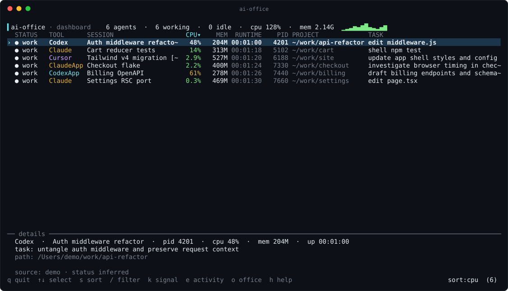

# ai-office

**Your AI coding agents, at their desks.** `ai-office` discovers every AI agent running on your machine — Claude Code, Codex, Cursor, Aider, and friends — and renders them as tiny workers in an animated ASCII office. When an agent is busy, it types. When it goes quiet, it wanders to the break room for a coffee. When it exits, it walks out the door.



There's a sun that crosses the office windows over the day (the moon takes the night shift), a wall clock that keeps real time, and a roomba that never stops patrolling. It is a process monitor. It is also an ant farm for your agents.

For when you want numbers instead of ambience, press `d`:



## Quick start

```bash
npx @flyvende/ai-office --demo     # fake agents, zero setup — see it move
npx @flyvende/ai-office            # your real agents
```

Or keep it around:

```bash
npm install -g @flyvende/ai-office
ai-office
```

Works on **macOS, Linux, and Windows**. Node 18+.

## Why

You start a Claude Code session. Then another one in a second terminal. Then Codex in a third, and at some point there are five agents burning tokens across four projects and you honestly could not say which of them is doing what. `ai-office` gives them one room: who's working, who's been idle for twenty minutes, what each one was asked to do, and how much CPU and memory the whole workforce is using.

Each agent is labeled with its **real session identity** — the tab title you gave it, its generated session title, or its project — and its **live task**: the last prompt you sent it, or the tool call it's running right now.

## One workspace, three views

**Office** (`o`, default) — a furnished ASCII studio: moving clouds and a day/night sky, animated monitors, typing hands, swaying plants, coffee steam, a blinking server rack and a patrolling roomba. Agents arrive, get coffee, lounge and return to their desks through continuous walking routes. Selection stays where you put it. A session list and current task sit below the scene; wide terminals add a session inspector with project, metrics and metadata source.

The full office needs **88 columns × 29 rows**; **130 × 35** adds room for the inspector and session list. Smaller terminals show a compact studio, and very short terminals show the metrics table. More than 12 agents get additional floors; selecting an agent follows them to their floor. Filtering preserves everyone’s desk.

**Dashboard** (`d`) — one row per agent: status, tool, session, CPU%, memory, runtime, PID, project, and current task, sortable by CPU, memory, runtime, tool, status or session name, with a per-agent detail pane and CPU sparkline. Columns drop gracefully on narrow terminals.

**Activity** (`e`, `--activity`) — a scrollable feed of arrivals, status changes, process exits and scan errors, newest first. It retains the last 200 events of this run even after agents disappear. Use `--history` for recorded sessions from previous runs.

All three views share selection and a text/PID filter. The bottom health bar shows scan age, duration and errors. A failed scan keeps the last good snapshot; `r` retries. Process exits are observations, not proof that a task succeeded.

Animation runs at **30 FPS** by default, independently of discovery. `p` pauses movement and resumes at the same position while data keeps updating. `m` or `--reduced-motion` seats agents immediately and freezes decorative motion.

## Also included

```bash
ai-office --once            # one discovery pass, human-readable
ai-office --once --json     # machine-readable snapshot (cpu/mem/runtime/task)
ai-office --watch           # headless: stream lifecycle events as NDJSON
ai-office --history         # what ran while you were away
```

`--watch` emits one JSON object per line for every agent lifecycle event — `started`, `status`, `stopped` (with runtime), perfect for piping:

```bash
ai-office --watch | jq 'select(.type == "stopped") | {tool: .toolName, session: .sessionName, ran: .runtimeMs}'
```

Completed sessions are appended to `~/.ai-office/history.jsonl` (disable with `--no-history`), and `--history` summarizes them by tool and project.

## Controls

```text
q / Ctrl-C   quit                    r     rescan now
tab / ↓ →    select next agent      ← ↑   select previous
o / d / e    office / dashboard / activity
s            cycle dashboard sort
/            filter sessions         esc   close help / clear filter
k            signal agent (TERM/INT/KILL)
c            show a quoted project-directory command
p            pause animation         m     reduced motion
h            help                    ↑↓    scroll activity
```

There's also a terminal bell + toast when an agent exits, and an optional idle alert (`idleAlertMs`).

## What it detects, and how

The scanner reads process metadata — `ps` on macOS/Linux, a PowerShell CIM query on Windows — and classifies likely agents:

| Agent | Surfaces |
| --- | --- |
| Claude Code | terminal |
| Claude Desktop | app (macOS, Windows incl. MS Store build) |
| Codex | CLI + desktop app |
| Cursor | app + helpers, grouped |
| Aider, Gemini, Goose, OpenCode, Qwen, Amp, … | terminal |
| Anything of yours | via `customTools` config |

Helper processes are grouped under their app, and CPU/memory are summed across the group.

For names and tasks, it reads the agents' **local session metadata** (Claude Code project JSONL, Codex session index/rollouts, Claude Desktop session files, Cursor workspaces) and matches sessions to processes by project path, session id, and start-time correlation — so three simultaneous Claude Code sessions each get their own name, even on Windows where process working directories aren't readable. On macOS it can also read terminal tab titles (the exact title Claude Code/Codex set) via AppleScript.

Everything is best-effort and confidence-scored; an agent that can't be identified still shows up, just with a generic name.

## Privacy

`ai-office` is local-only. **No telemetry, no network calls, ever.** No keylogging, no clipboard access, no screen recording.

It reads: the process table, and (by default) the local session-metadata files the agent tools already keep on your disk — to show titles, tasks, and project names. Set `"enableSessionMetadataScan": false` to use process metadata only. Session history stores tool name, title, project label, PID, and timing — never file contents.

## Configuration

Config lives at `~/.ai-office/config.json` (or pass `--config <path>`). Everything is optional:

```json
{
  "scanIntervalMs": 2000,
  "stoppedGraceMs": 10000,
  "enableSessionMetadataScan": true,
  "enableWindowTitleScan": true,
  "enableHistory": true,
  "bellOnFinish": true,
  "idleAlertMs": 0,
  "defaultView": "office",
  "animationFps": 30,
  "reducedMotion": false,
  "customTools": [
    {
      "key": "my-agent",
      "name": "My Agent",
      "color": "magenta",
      "processNames": ["my-agent"],
      "commandPatterns": ["my-agent", "regex:\\bmy-ai-tool\\b"]
    }
  ]
}
```

| Key | Default | Meaning |
| --- | --- | --- |
| `scanIntervalMs` | `2000` | Process scan cadence. |
| `stoppedGraceMs` | `10000` | How long a finished agent lingers before walking out. |
| `enableSessionMetadataScan` | `true` | Read local session caches for names/tasks. |
| `enableWindowTitleScan` | `true` | Read terminal tab titles (macOS only). |
| `enableAppWindowTitleScan` | `false` | Read desktop app window titles (macOS, needs Accessibility). |
| `enableHistory` | `true` | Record completed sessions to `~/.ai-office/history.jsonl`. |
| `bellOnFinish` | `true` | Terminal bell when an agent finishes. |
| `idleAlertMs` | `0` | Alert when an agent idles this long (`0` = off). |
| `defaultView` | `"office"` | `"office"`, `"dashboard"` or `"activity"`. |
| `animationFps` | `30` | Animation cadence, clamped to 5–60 FPS. |
| `reducedMotion` | `false` | Static scenery and seated agents; discovery remains live. |
| `customTools` | `[]` | Extra detectors; `commandPatterns` are substrings, prefix `regex:` for regex. |

CLI flags override config: `--scan-interval`, `--dashboard`, `--activity`, `--reduced-motion`, `--no-history`, `--filter <text>`, `--debug`.

## Architecture

```text
bin/ai-office.js        CLI entry: TUI, --once, --watch, --history
src/discovery/          process scanners (ps / PowerShell CIM), cwd + session metadata, titles
src/detection/          provider modules that classify processes into agents
src/state/              cross-scan store, lifecycle events, JSONL history
src/tui/workspace.js    stable focus, scan health and bounded lifecycle feed
src/tui/office.js       full / compact office and inspector renderer
src/tui/floor.js        character art and walkable geometry
src/tui/motion.js       continuous routes and pause-aware animation clock
src/tui/activity.js     scrollable lifecycle feed
src/tui/dashboard.js    the metrics table renderer
src/tui/theme.js        one palette for everything
src/demo.js             fake agents for --demo
```

To add a detector: drop a module in `src/detection/providers/`, return a candidate via `makeCandidate()`, register it in `src/detection/index.js`, add a test. To regenerate the README animation: `node scripts/render-svg.js`.

```bash
npm install
npm test        # node --test
npm run check   # syntax-check every file
npm run demo
```

## Limitations

- Status is inferred from process state and session-file activity, not private APIs — "idle" means *the session file has gone quiet*, not that the model told us so.
- CPU% is sampled between scans; the first reading for a process is its lifetime average.
- On Windows, project paths come from session metadata (there's no `lsof`), so an agent with no readable session may show without a project.
- Desktop apps spawn many helpers; grouping depends on the process tree being visible.

## License

MIT © Tobias Preisler
